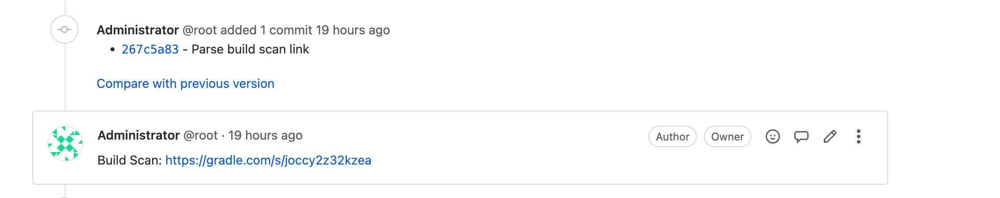
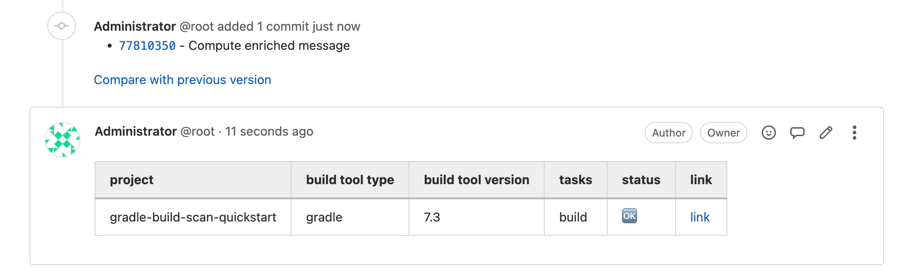

## Description

Automatically comment Develocity build scan links when a merge request build is triggered.
The build scan link is parsed from the console log.
An enriched mode allows to comment as well some advanced build information (see screenshots).

## Prerequisites
- The build is triggered from a merge request
- A build scan is published to Develocity
- _jq_ is available on the runner
- the _before_script_ is not overriden

## Note
4 HTTP calls will be triggered on each build:
- 1X HTTP GET: Fetch build log from Gitlab API
- 1X HTTP GET: Fetch build data from Develocity API (Enriched mode only)
- 1X HTTP GET: Fetch build detailed data from Develocity API (Enriched mode only)
- 1X HTTP POST: Post merge request comment on Gitlab API

## Screenshots

- Classic mode


- Enriched mode


## Inputs
- _GITLAB_API_URL_: Gitlab API URL (usually available as CI_API_V4_URL)
- _GITLAB_API_TOKEN_: access token to Gitlab API
- _DEVELOCITY_URL_: Develocity URL
- _DEVELOCITY_API_TOKEN_: access token to Develocity API

_DEVELOCITY_URL_ and _DEVELOCITY_API_TOKEN_ parameters can be omitted to comment the build scan link but not the advanced build attributes.

## Usage
```
[...]

include:
  - 'https://raw.githubusercontent.com/jprinet/gitlab-ci-utils/main/comment-merge-request/comment-merge-request-with-build-scan.yml'

[...]

build-job:
  stage: build
  script:
    - ./gradlew build
    - comment_merge_request ${CI_API_V4_URL} ${GITLAB_API_TOKEN} ${GE_URL} ${GE_API_TOKEN}
```
